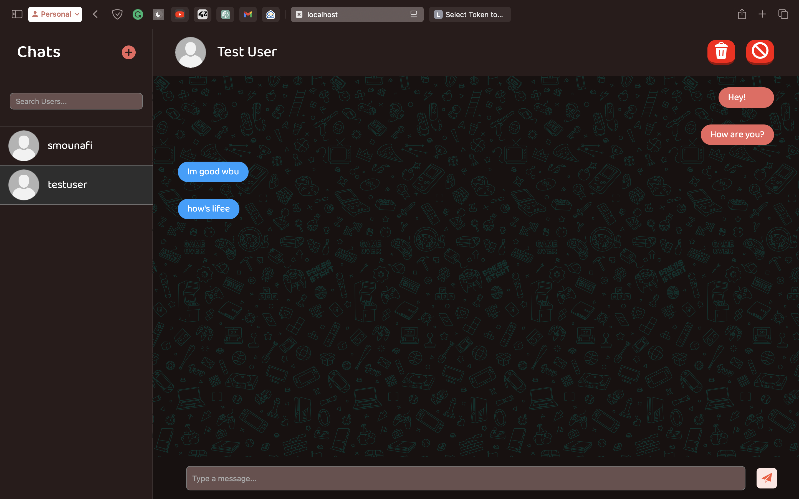

# Chatify

**Chatify** is a real-time, responsive live chat application built with Django (backend) and vanilla JavaScript (frontend). It is designed for seamless user-to-user communication, featuring message sending, blocking, and message deletion. The app updates in real time, ensuring smooth interaction and usability.

---

## Features

- All these features are real-time

### 1. **Real-time Messaging**
   - Chatify allows users to send and receive messages instantly with WebSocket integration.
   - Each conversation is updated in real time without needing to refresh the page.

### 2. **User Blocking**
   - Block users from sending messages to you, improving the user experience in case of unwanted interactions.

### 3. **Message Deletion**
   - Users can delete their own messages.

---

## Screenshots

Here are some example screenshots of Chatify in action:

### Chat Landing Page


### Conversation View


### Login View


### Finding Friends View


---

## Tech Stack

- **Backend**: Django, Django Channels (WebSockets), Django REST Framework
- **Frontend**: Vanilla JavaScript, HTML, CSS (Some Responsivity)
- **Database**: PostgreSQL
- **Authentication**: Djoser Library
- **Deployment**: Docker, Docker Compose

---

## Installation

1. **Clone the repository**:
   ```bash
   git clone https://github.com/your-username/chatify.git
   cd chatify
   ```
2. **Run the Makefile**:
   Run ```make``` to run the app
3. **Access the App**
   Open your browser and navigate to ```http://localhost:8000``` to access Chatify's Registration Page.

---

## Important Notes

- **No Default Users**: By default, there are no pre-existing users in Chatify. Any registered user can be accessed via the **Plus (+) icon** or the **'FIND FRIENDS'** feature by searching for their **username**. This allows users to easily connect with others by their unique usernames.
- The /backend/.env file is available you can edit database name and passwords.
